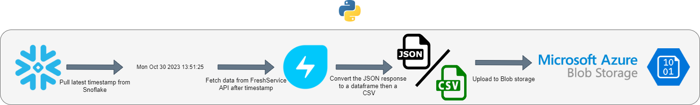

# Python-Fresh-Service-API
A Python app to pull data from the FreshService API.

## Introduction
---------------
Freshservice is a cloud-based IT Service Management (ITSM) solution that helps organizations streamline their IT support and service operations. Companies use Freshservice to efficiently manage and resolve IT-related issues, ensure smooth IT operations, and enhance the overall user experience for their employees. Some companies want to create custom FreshService reports using Tableau or PowerBI, and require FreshService data to be available in their data warehouse platform, like Snowflake. This Python application can help developers tasked with bringing in data from the FS API into Snowflake via an external stage.

## How it Works
---------------


1. Initialization:
   - The script starts by setting up logging configurations to monitor its operations.
   - Paths to the Freshservice API key and Snowpark credentials are specified.
   - Azure Blob storage details and Freshservice domain information are initialized.

2. Snowflake Session Creation:
   - A Snowflake session is established using the provided Snowpark credentials.
   - This session is used to interact with the Snowflake database.
  
3. Fetching API Key:
   - The Freshservice API key is retrieved from the specified credentials file.

4. Timestamp Retrieval:
   - The script fetches the latest timestamp (either UPDATED_AT or CREATED_AT) from the TICKETS table in Snowflake.
   - This timestamp is used to determine which tickets need to be fetched from Freshservice.

5. Data Fetching from Freshservice:
   - Using the API key, the script fetches data from specified Freshservice endpoints.
   - This includes data related to tickets, ticket fields, and agent groups.

6. Data Processing:
   - The fetched data is processed and normalized.
   - JSON data is converted to CSVs
   - Any necessary transformations, such as renaming columns, are performed.

7. Uploading to Azure Blob Storage:
   - The processed data is then uploaded to specified paths in Azure Blob storage.
   - This includes separate uploads for agent groups, tickets, and ticket fields.

> At this point, developers familiar with Snowflake's Snowpark connector for python might be wondering, "Why not just write the data frames directly to Snowflake tables using the method `snowflake.snowpark.Session.write_pandas`?" The reason is that loading data from an Azure external stage only needs one query to execute the `COPY INTO` command, where the `snowflake.snowpark.Session.write_pandas` uses three or more queries and would be less efficent at scale

8. Error Handling:
   - Throughout its operations, the script has built-in error handling mechanisms.
   - Specific errors, such as Snowflake SQL compilation errors, are caught and logged.

9. Execution:
   - The entire process is wrapped in the main() function.
   - When the script is run, this function is executed, setting off the sequence of operations.

## Dependencies and Installation
----------------------------
To install the app, please follow these steps:

1. Clone the repository to your local machine.

2. Install the required dependencies by running the following command:
   ```
   pip install -r requirements.txt
   ```

3. Obtain an API key from FreshService and save it as a CSV. Do the same for your Snowflake credentials, formatting the CSV as done [here](https://docs.snowflake.com/en/developer-guide/snowpark/python/creating-session), and your Azure storage account credentials as well. Add this information to the `main.py` file in the project directory at the top of the script.
    ```python
    api_creds_path = r'C:\Credentials\FS_API_KEY.csv' # directory holding the API key
    sf_creds_path = r'C:\Credentials\SNOWPARK_DEV_LOADER_CREDS.CSV' # directory holding the Snowpark credentials
    account_name = '' # your company's Azure Storage account name
    container_name = '' # azure blob storage container name
    sas_token = '' # your azure blob storage shared access signature used for authentication
    ```

## Usage
-----
To use the app, follow these steps:

1. Ensure that you have installed the required dependencies and added the required information to the `main.py` file.

2. Run the `main.py` file using following command:
   ```
   python main.py
   ```

3. The application will execute and being logging to the console.

4. Load the data from your Azure storage container as demonstrated on the [Snowflake Documentation](https://docs.snowflake.com/en/user-guide/data-load-azure-copy)

## Contributing
------------
This repository is intended for educational purposes and does not accept further contributions. Feel free to utilize and enhance the app based on your own requirements. Any similarity to other apps is purely coincidental and not intended to infringe on any intelectual property rights or private data.

## License
-------
This app is released under the [MIT License](https://opensource.org/licenses/MIT).
